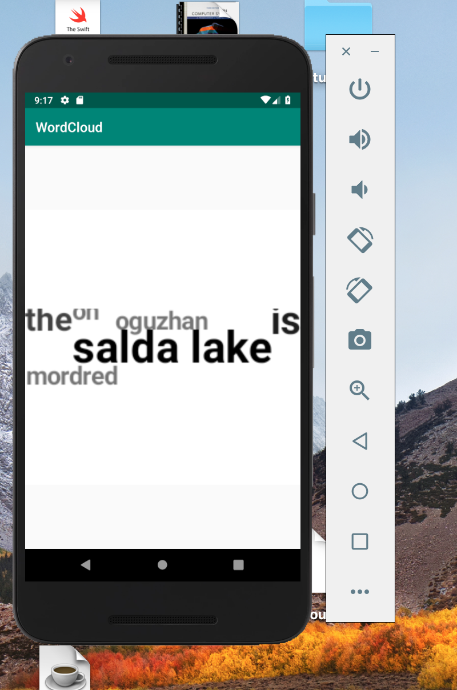

# WordCloud

WordCloud is an android library for the processing text and generating wordcloud/tagcloud as in Bitmap type..

## GETTING STARTED

You can directly import the WordCloud library from JCenter/Maven or Gradle:

Maven:

```xml
<dependency>
    <groupId>com.mordred.wordcloud</groupId>
    <artifactId>Wordcloud</artifactId>
    <version>2.4</version>
</dependency>
```

Gradle:

```
dependencies {
    compile 'com.mordred.wordcloud:Wordcloud:2.4'
}
```

### Current Features

- It currently supports rectangular wordcloud
- Stop-word support in 50 language
- Stemmer support in 24 language (It uses Snowball Stemmer)
- Variable Font Sizes.
- Variable dimension size for resulting Bitmap wordcloud image
- Custom BackGround Color.
- Custom TypeFace(Font) support
- Auto-scaling opacity of words by their frequency(count)
- Efficient Frequency Analyzer for splitting,normalizing and computing word frequency(count).

### Screenshots



### Examples

Example to generate a Word Cloud on top of an image.

```java
Map<String, Integer> wordMap = new HashMap<>();

wordMap.put("oguzhan", 2); // "oguzhan" -> word, "2" -> word count
wordMap.put("mordred", 2);
wordMap.put("is", 4);
wordMap.put("on",2);
wordMap.put("the", 3);
wordMap.put("salda lake",5);

WordCloud wd = new WordCloud(wordMap, 250, 250,Color.BLACK,Color.WHITE);
wd.setWordColorOpacityAuto(true);

Bitmap generatedWordCloudBmp = wd.generate();
```

### Contributing

Any contributions are welcome :+1:
